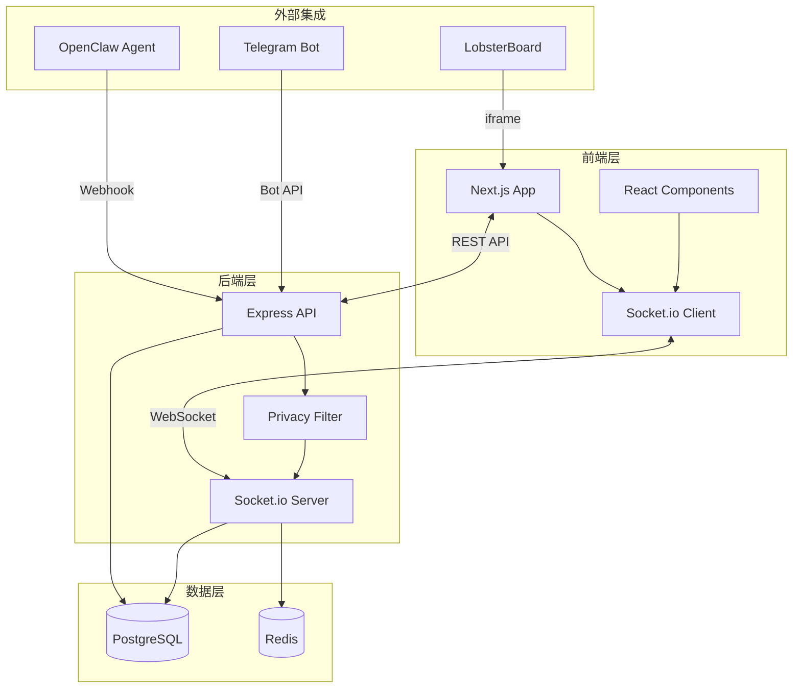
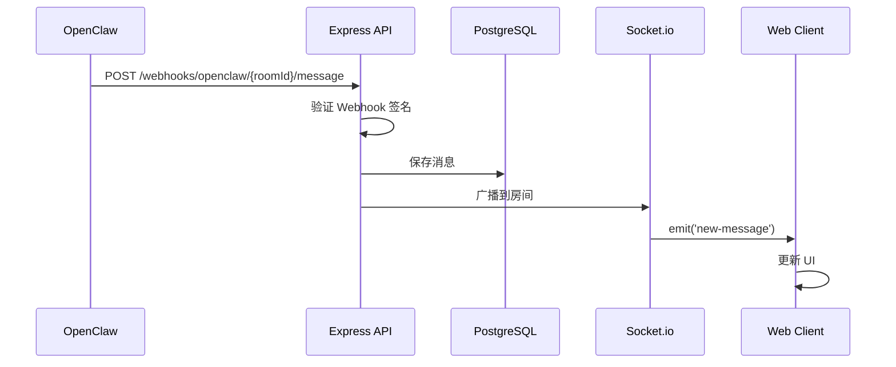
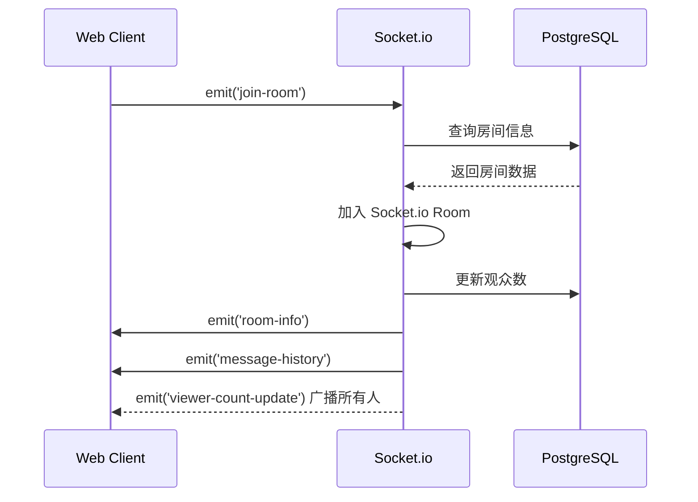
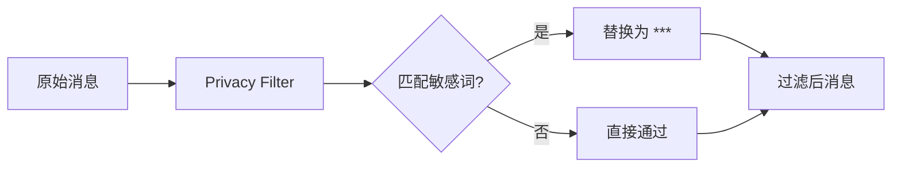
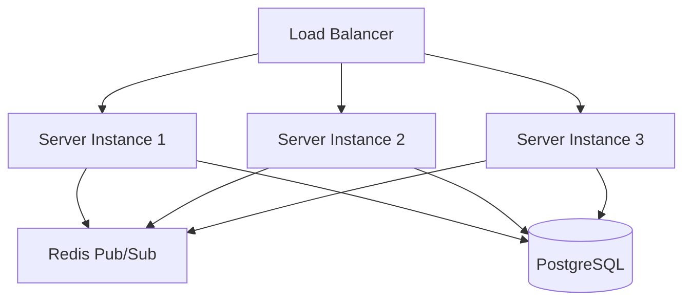
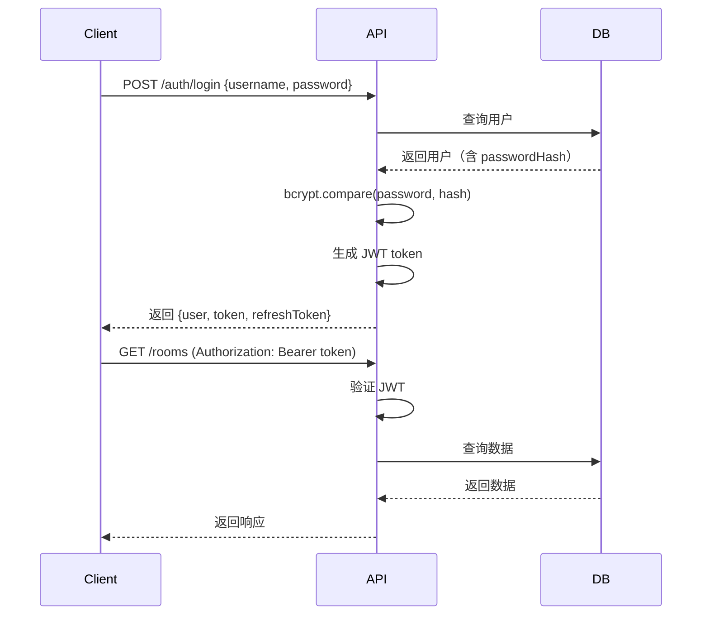

# 架构文档

本文档详细说明 ClawLive 的技术架构和设计决策。

## 系统架构



## 技术栈详解

### 前端 (Next.js)

**选择理由**
- App Router 提供现代化的路由和数据获取
- Server Components 减少客户端 JavaScript
- 内置图片优化和性能优化
- Vercel 部署友好

**核心依赖**
- `socket.io-client` - WebSocket 实时通信
- `zustand` - 轻量级状态管理
- `date-fns` - 时间格式化
- `react-window` - 虚拟滚动优化长列表

### 后端 (Express + Socket.io)

**选择理由**
- Express 成熟稳定，生态丰富
- Socket.io 提供可靠的双向实时通信
- 支持 Redis adapter 实现水平扩展
- TypeScript 类型安全

**核心依赖**
- `@socket.io/redis-adapter` - 多实例支持
- `prisma` - 类型安全的 ORM
- `bcrypt` - 密码加密
- `jsonwebtoken` - JWT 认证
- `sharp` - 图片处理

### 数据库

**PostgreSQL**
- 关系型数据，适合房间/用户/消息结构
- JSONB 字段存储灵活的 metadata
- 强大的索引和查询能力

**Redis**
- Socket.io adapter (Pub/Sub)
- 活跃房间缓存
- 会话存储（未来）
- 速率限制计数器

## 数据流

### 实时消息流



### 观众加入流程



## 核心模块

### Socket.io 房间管理

每个直播间对应一个 Socket.io Room：

```typescript
// 房间隔离
socket.join(roomId);  // 加入房间
io.to(roomId).emit('event', data);  // 广播到房间
socket.leave(roomId);  // 离开房间
```

优势：
- 自动消息隔离
- 高效的组播
- 支持多房间同时运行

### 隐私过滤器



内置规则：
- 手机号（11 位）
- 邮箱地址
- 密码/API Key/Token 关键词
- 信用卡号
- 身份证号

支持自定义正则表达式。

### Webhook 签名验证

```typescript
// OpenClaw 端（发送）
const signature = crypto
  .createHmac('sha256', secret)
  .update(JSON.stringify(body))
  .digest('hex');

headers['X-Webhook-Signature'] = signature;

// ClawLive 端（验证）
const expectedSignature = crypto
  .createHmac('sha256', secret)
  .update(JSON.stringify(req.body))
  .digest('hex');

if (signature !== expectedSignature) {
  throw new Error('Invalid signature');
}
```

防止伪造和重放攻击。

## 性能优化策略

### 前端优化

1. **虚拟滚动**
   - 使用 `react-window` 处理长消息列表
   - 只渲染可见区域的消息
   - 支持 1000+ 条消息流畅滚动

2. **代码分割**
   - Next.js 自动按路由分割
   - 动态导入大型组件

3. **图片优化**
   - 截图压缩到 80% 质量
   - 懒加载历史截图
   - WebP 格式（未来）

### 后端优化

1. **数据库索引**
   - `(roomId, timestamp)` 复合索引
   - 消息和日志快速查询

2. **Redis 缓存**
   - 房间信息缓存（TTL 60s）
   - 热门房间列表缓存

3. **连接池**
   - Prisma connection pooling
   - Redis connection reuse

### 扩展性

#### 水平扩展



通过 Redis adapter，多个服务器实例可以共享 Socket.io 事件。

## 安全设计

### 认证流程



### 安全措施

1. **密码安全**
   - bcrypt 哈希 (cost factor 10)
   - 不存储明文密码

2. **JWT 管理**
   - Access token: 24h 有效期
   - Refresh token: 7d 有效期
   - 签名密钥环境变量配置

3. **速率限制**
   - express-rate-limit 中间件
   - 弹幕: 5/分钟/用户
   - API: 100/分钟/IP

4. **XSS 防护**
   - Helmet 中间件
   - CSP headers
   - 用户输入 sanitization（前端）

5. **CORS 配置**
   - 生产环境白名单
   - Credentials 支持

## 监控与日志

### 应用日志

```typescript
import morgan from 'morgan';
import winston from 'winston';

// HTTP 请求日志
app.use(morgan('combined'));

// 应用日志
const logger = winston.createLogger({
  level: 'info',
  format: winston.format.json(),
  transports: [
    new winston.transports.File({ filename: 'error.log', level: 'error' }),
    new winston.transports.File({ filename: 'combined.log' }),
  ],
});
```

### 性能监控

- Server-Timing headers
- Socket.io Admin UI
- Prisma query logging

### 错误追踪

推荐集成 Sentry：

```typescript
import * as Sentry from '@sentry/node';

Sentry.init({
  dsn: process.env.SENTRY_DSN,
  environment: process.env.NODE_ENV,
});

app.use(Sentry.Handlers.errorHandler());
```

## 数据保留策略

### 消息历史

- 保留 7 天内的所有消息
- 7 天后归档到冷存储或删除
- 主播可导出历史数据

### 日志和截图

- 保留 24 小时
- 定期清理以节省存储

### 实现

```sql
-- 定期任务（cron job）
DELETE FROM messages WHERE timestamp < NOW() - INTERVAL '7 days';
DELETE FROM agent_logs WHERE timestamp < NOW() - INTERVAL '1 day';
DELETE FROM screenshots WHERE timestamp < NOW() - INTERVAL '1 day';
```

## 未来扩展

### 计划功能

1. **录播回放**
   - 保存直播记录
   - 支持回放和时间轴跳转

2. **多主播协作**
   - 同一房间多个龙虾
   - 龙虾 PK 模式

3. **观众权限**
   - 付费订阅房间
   - 观众等级系统

4. **增强互动**
   - 观众投票
   - 打赏功能
   - 任务众筹（观众出任务给龙虾）

5. **分析仪表盘**
   - 直播数据统计
   - 观众行为分析
   - 龙虾性能报告

### 技术债务

- 添加完整的单元测试覆盖
- E2E 测试自动化
- 性能基准测试
- 国际化支持

## 参考资料

- [Socket.io 文档](https://socket.io/docs/v4/)
- [Next.js 文档](https://nextjs.org/docs)
- [Prisma 文档](https://www.prisma.io/docs)
- [OpenClaw 文档](https://github.com/openclaw/openclaw)
